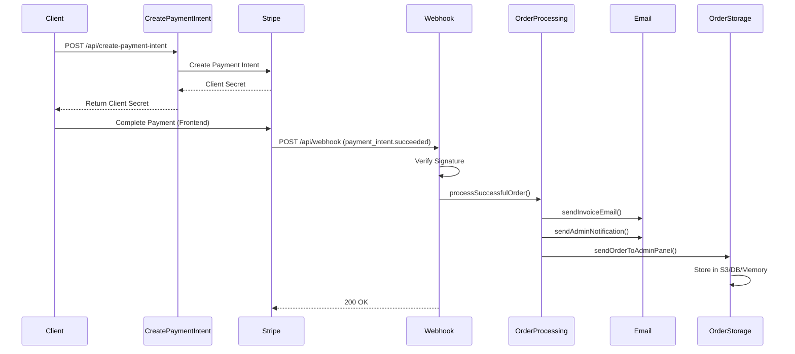
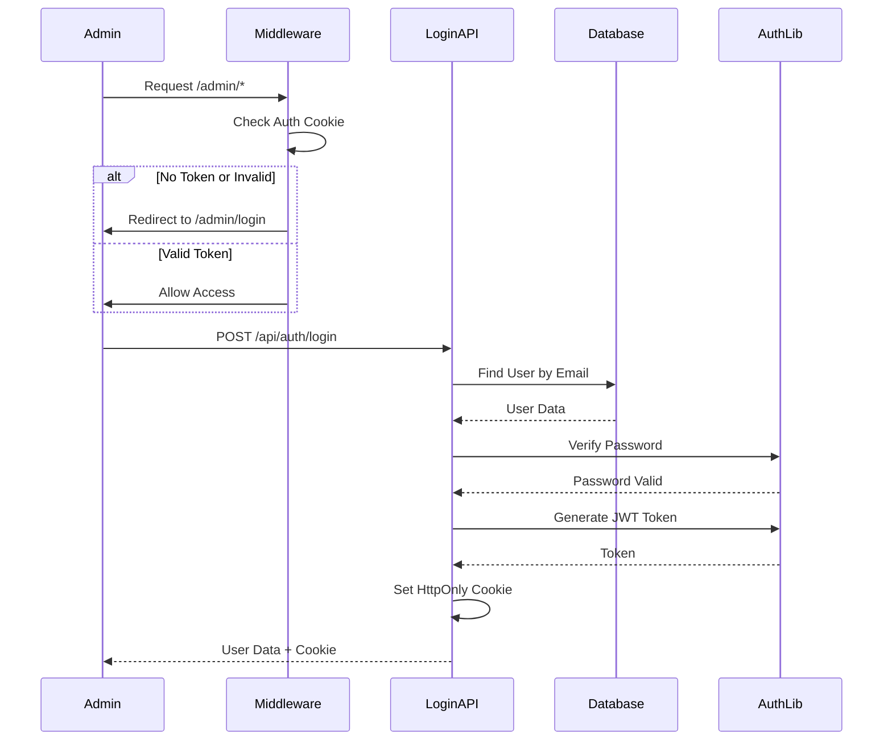
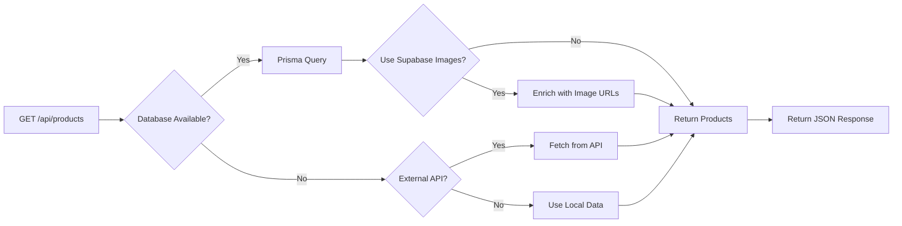

# Backend API Flowchart

This document provides a visual representation of how the backend API works in this codebase.

## Main API Flows

```mermaid
flowchart TD
    Start([Client Request]) --> RouteType{Request Type}
    
    %% Product Flow
    RouteType -->|GET /api/products| ProductFlow[Product API]
    ProductFlow --> CheckDB{Database Available?}
    CheckDB -->|Yes| FetchDB[Fetch from Prisma/Supabase]
    CheckDB -->|No| CheckAPI{External API Configured?}
    CheckAPI -->|Yes| FetchAPI[Fetch from External API]
    CheckAPI -->|No| FetchLocal[Use Local Product Data]
    FetchDB --> EnrichImages{Use Supabase Images?}
    EnrichImages -->|Yes| GetImageURLs[Enrich with Image URLs]
    EnrichImages -->|No| ReturnProducts[Return Products]
    FetchAPI --> ReturnProducts
    FetchLocal --> ReturnProducts
    GetImageURLs --> ReturnProducts
    ReturnProducts --> End1([Response])
    
    %% Payment Intent Flow
    RouteType -->|POST /api/create-payment-intent| PaymentFlow[Create Payment Intent]
    PaymentFlow --> ValidateAmount{Amount Valid?}
    ValidateAmount -->|No| Error1[Return 400 Error]
    ValidateAmount -->|Yes| CheckTestMode{Test Mode Enabled?}
    CheckTestMode -->|Yes| CreateMock[Create Mock Payment Intent]
    CheckTestMode -->|No| CheckStripe{Stripe Configured?}
    CheckStripe -->|No| Error2[Return 500 Error]
    CheckStripe -->|Yes| CreateStripe[Create Stripe Payment Intent]
    CreateMock --> ReturnClientSecret[Return Client Secret]
    CreateStripe --> ReturnClientSecret
    ReturnClientSecret --> End2([Response])
    Error1 --> End2
    Error2 --> End2
    
    %% Webhook Flow
    RouteType -->|POST /api/webhook| WebhookFlow[Stripe Webhook]
    WebhookFlow --> CheckTestMode2{Test Mode?}
    CheckTestMode2 -->|Yes| ParseTestEvent[Parse Test Event]
    CheckTestMode2 -->|No| CheckSignature{Signature Present?}
    CheckSignature -->|No| Error3[Return 400 Error]
    CheckSignature -->|Yes| VerifySignature[Verify Stripe Signature]
    VerifySignature -->|Invalid| Error4[Return 400 Error]
    VerifySignature -->|Valid| ProcessEvent[Process Webhook Event]
    ParseTestEvent --> ProcessEvent
    ProcessEvent --> EventType{Event Type}
    
    EventType -->|payment_intent.succeeded| SuccessFlow[Payment Succeeded]
    EventType -->|payment_intent.payment_failed| FailedFlow[Payment Failed]
    EventType -->|Other| Unhandled[Log Unhandled Event]
    
    SuccessFlow --> SendInvoice[Send Invoice Email]
    SuccessFlow --> SendAdminNotif[Send Admin Notification]
    SuccessFlow --> ProcessOrder[Process Successful Order]
    ProcessOrder --> StoreOrder[Store Order]
    StoreOrder --> End3([Return Success])
    
    FailedFlow --> ProcessFailed[Process Failed Payment]
    ProcessFailed --> End3
    Unhandled --> End3
    Error3 --> End3
    Error4 --> End3
    
    %% Order Storage Flow
    StoreOrder --> StorageType{Storage Type?}
    StorageType -->|s3| S3Flow[S3 Storage]
    StorageType -->|database| DBFlow[Database Storage]
    StorageType -->|internal| MemoryFlow[Memory Storage]
    
    S3Flow --> CheckAWSCreds{AWS Credentials?}
    CheckAWSCreds -->|No| Error5[Return 500 Error]
    CheckAWSCreds -->|Yes| UploadS3[Upload to S3]
    UploadS3 --> StoreMemory1[Also Store in Memory]
    StoreMemory1 --> End4([Return Success])
    
    DBFlow --> CheckDBURL{DATABASE_URL?}
    CheckDBURL -->|No| Error6[Return 500 Error]
    CheckDBURL -->|Yes| StoreDB[Store via Prisma]
    StoreDB --> StoreMemory2[Also Store in Memory]
    StoreMemory2 --> End4
    
    MemoryFlow --> StoreMemory3[Store in Memory]
    StoreMemory3 --> End4
    Error5 --> End4
    Error6 --> End4
    
    %% Admin Auth Flow
    RouteType -->|POST /api/auth/login| LoginFlow[Admin Login]
    LoginFlow --> ValidateInput{Email & Password?}
    ValidateInput -->|No| Error7[Return 400 Error]
    ValidateInput -->|Yes| FindUser[Find User in Database]
    FindUser --> UserExists{User Exists & Active?}
    UserExists -->|No| Error8[Return 401 Error]
    UserExists -->|Yes| VerifyPass[Verify Password]
    VerifyPass -->|Invalid| Error8
    VerifyPass -->|Valid| UpdateLogin[Update Last Login]
    UpdateLogin --> GenerateToken[Generate JWT Token]
    GenerateToken --> SetCookie[Set Auth Cookie]
    SetCookie --> End5([Return User Data])
    Error7 --> End5
    Error8 --> End5
    
    RouteType -->|POST /api/auth/logout| LogoutFlow[Admin Logout]
    LogoutFlow --> ClearCookie[Clear Auth Cookie]
    ClearCookie --> End6([Return Success])
    
    RouteType -->|GET /api/auth/me| MeFlow[Get Current User]
    MeFlow --> CheckAuth{Authenticated?}
    CheckAuth -->|No| Error9[Return 401 Error]
    CheckAuth -->|Yes| FetchUser[Fetch User from DB]
    FetchUser --> End7([Return User Data])
    Error9 --> End7
    
    %% Admin Orders Flow
    RouteType -->|GET /api/admin/orders| AdminOrdersFlow[Get Orders]
    AdminOrdersFlow --> MiddlewareCheck{Middleware Auth Check}
    MiddlewareCheck -->|No Token| RedirectLogin[Redirect to Login]
    MiddlewareCheck -->|Invalid Token| RedirectLogin
    MiddlewareCheck -->|Valid Token| RequireAuth[Require Auth]
    RequireAuth -->|Unauthorized| Error10[Return 401 Error]
    RequireAuth -->|Authorized| CheckDB2{Database Available?}
    CheckDB2 -->|Yes| FetchOrdersDB[Fetch from Database]
    CheckDB2 -->|No| FetchOrdersMem[Fetch from Memory]
    FetchOrdersDB --> TransformOrders[Transform Orders]
    FetchOrdersMem --> TransformOrders
    TransformOrders --> IncludeMetrics{Include Metrics?}
    IncludeMetrics -->|Yes| GetMetrics[Get Order Metrics]
    IncludeMetrics -->|No| ReturnOrders[Return Orders]
    GetMetrics --> ReturnOrders
    ReturnOrders --> End8([Response])
    Error10 --> End8
    RedirectLogin --> End8
    
    RouteType -->|POST /api/admin/orders| StoreOrderFlow[Store Order Admin]
    StoreOrderFlow --> CheckAPIKey{API Key Valid?}
    CheckAPIKey -->|No| Error11[Return 401 Error]
    CheckAPIKey -->|Yes| ValidateFields{Required Fields?}
    ValidateFields -->|No| Error12[Return 400 Error]
    ValidateFields -->|Yes| StoreOrderMem[Store in Memory]
    StoreOrderMem --> End9([Return Success])
    Error11 --> End9
    Error12 --> End9
    
    RouteType -->|PATCH /api/admin/orders/[id]/status| UpdateStatusFlow[Update Order Status]
    UpdateStatusFlow --> RequireAuth2[Require Auth]
    RequireAuth2 -->|Unauthorized| Error13[Return 401 Error]
    RequireAuth2 -->|Authorized| ValidateStatus{Valid Status?}
    ValidateStatus -->|No| Error14[Return 400 Error]
    ValidateStatus -->|Yes| UpdateStatus[Update Order Status]
    UpdateStatus --> End10([Return Success])
    Error13 --> End10
    Error14 --> End10
    
    %% Middleware Flow
    RouteType -->|/admin/*| MiddlewareFlow[Middleware]
    MiddlewareFlow --> IsLoginPage{Is Login Page?}
    IsLoginPage -->|Yes| Allow[Allow Access]
    IsLoginPage -->|No| GetCookie[Get Auth Cookie]
    GetCookie --> HasToken{Token Present?}
    HasToken -->|No| Redirect[Redirect to Login]
    HasToken -->|Yes| VerifyToken[Verify JWT Token]
    VerifyToken -->|Invalid| Redirect
    VerifyToken -->|Valid| IsAdmin{Is Admin Type?}
    IsAdmin -->|No| Redirect
    IsAdmin -->|Yes| Allow
    Allow --> End11([Continue])
    Redirect --> End11
```

## Detailed Component Interactions

### Payment Processing Flow



### Admin Authentication Flow



### Product Fetching Flow



## Key Components

### 1. **Product API** (`/api/products`)
- **Priority**: Database (Prisma/Supabase) → External API → Local Data
- **Features**: Image URL enrichment from Supabase Storage
- **Caching**: 60-second revalidation for external API

### 2. **Payment Intent API** (`/api/create-payment-intent`)
- **Test Mode**: Creates mock payment intents without Stripe
- **Production**: Creates real Stripe payment intents
- **Returns**: Client secret for frontend payment confirmation

### 3. **Webhook API** (`/api/webhook`)
- **Events Handled**:
  - `payment_intent.succeeded`: Sends emails, processes order, stores order
  - `payment_intent.payment_failed`: Processes failed payment
- **Test Mode**: Allows webhook simulation without signature verification
- **Production**: Verifies Stripe webhook signature

### 4. **Order Storage** (`/api/orders/store`)
- **Storage Types**:
  - **S3**: AWS S3 bucket storage
  - **Database**: Prisma/Supabase storage
  - **Internal**: In-memory storage (default)
- **Fallback**: Always stores in memory for admin panel access

### 5. **Admin Authentication**
- **Login** (`/api/auth/login`): Validates credentials, generates JWT, sets cookie
- **Logout** (`/api/auth/logout`): Clears auth cookie
- **Me** (`/api/auth/me`): Returns current authenticated user
- **Middleware**: Protects `/admin/*` routes, redirects to login if unauthorized

### 6. **Admin Orders API**
- **GET** (`/api/admin/orders`): Fetches orders from database or memory, requires auth
- **POST** (`/api/admin/orders`): Stores order (internal API, optional API key)
- **PATCH** (`/api/admin/orders/[id]/status`): Updates order status, requires auth

## Environment Variables

Key environment variables that affect API behavior:

- `STRIPE_SECRET_KEY`: Stripe API key (production)
- `STRIPE_WEBHOOK_SECRET`: Webhook signature verification
- `STRIPE_TEST_MODE`: Enable test mode
- `DATABASE_URL`: Prisma/Supabase connection
- `ORDER_STORAGE_TYPE`: Storage type (s3, database, internal)
- `AWS_ACCESS_KEY_ID`, `AWS_SECRET_ACCESS_KEY`: S3 credentials
- `JWT_SECRET`: JWT token signing secret
- `ADMIN_PANEL_API_URL`: External admin panel URL (optional)
- `USE_PRODUCTS_DATABASE`: Enable database product fetching
- `USE_SUPABASE_IMAGES`: Enable Supabase image URL enrichment

## Error Handling

All API routes follow consistent error handling:
- **400**: Bad Request (validation errors)
- **401**: Unauthorized (authentication required)
- **404**: Not Found (resource doesn't exist)
- **500**: Internal Server Error (server-side errors)

Errors are logged to console and returned as JSON with error messages.

